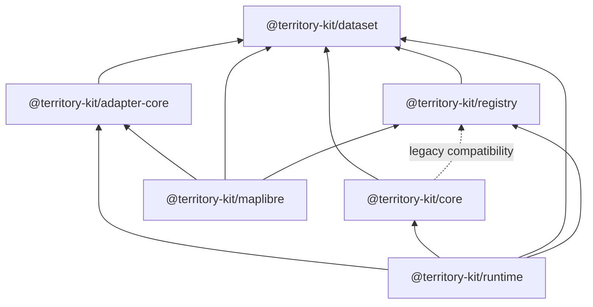

# ADR-003: Runtime And Adapter Boundaries

## Status

Accepted for Sprint 11.

## Context

TerritoryKit has a stable in-memory core engine, registry package, and MapLibre adapter. Runtime
coordination, multi-dataset catalogs, binary spatial indexes, workers, and production mobile/map
adapters need clearer package boundaries before implementation.

## Problem

`@territory-kit/core` re-exported registry APIs and MapLibre imported registry types through core.
There was no renderer-independent adapter contract and no shared coded error model.

## Decision

- Add `@territory-kit/adapter-core` for renderer-independent adapter contracts.
- Add `@territory-kit/runtime` for minimal lifecycle contracts and future orchestration.
- Keep shared `TerritoryError` codes in `@territory-kit/dataset`.
- Preserve core registry root exports as deprecated compatibility exports.
- Add `@territory-kit/core/legacy-registry` for isolated compatibility imports.
- Update MapLibre to implement `TerritoryRendererAdapter<TerritoryMapLibreMap>`.

## Dependency Direction

## Core Non-Responsibilities

Core must not know about registry network transports, filesystems, renderer targets, MapLibre,
NestJS, runtime catalogs, or worker orchestration.

## Runtime Responsibilities

Runtime coordinates registry, dataset, cache, engine, request, viewport, and adapter lifecycle work.
Sprint 11 implemented create/state/subscribe/dispose behavior; Sprint 12 implements the viewport
request lifecycle, cancellation, memory cache strategy, and renderer-neutral adapter source
orchestration described in ADR-004. Worker orchestration remains future Sprint 13 work.

## Adapter-Core Responsibilities

Adapter-core defines capabilities, lifecycle states, render sources, state, themes, transitions,
events, and helper guards. It does not implement MapLibre, Leaflet, OpenLayers, DOM, or mobile
renderer behavior.

## Error Model

`TerritoryError` in `@territory-kit/dataset` provides stable codes, safe details, `cause`, and
serialization/deserialization. Existing error classes become compatible subclasses where practical.

## Compatibility Strategy

No public API is removed in Sprint 11. Deprecated compatibility exports remain documented, tested,
and isolated so future major removal can be planned.

## Alternatives Considered

- Put errors in a new `@territory-kit/errors` package. Rejected for now because dataset is already
  the dependency root and a new package would add release overhead.
- Move registry exports out of core immediately. Rejected because it would be a breaking change.
- Put adapter contracts inside MapLibre. Rejected because Leaflet, OpenLayers, and mobile adapters
  need renderer-independent contracts.

## Consequences

- Runtime and adapter work can proceed without pulling renderer or network responsibilities into
  core.
- Core keeps a temporary registry dependency solely for compatibility.
- Dataset bundle size grows modestly because it now owns the shared error serializer.

## Migration Strategy

New code should import:

- registry APIs from `@territory-kit/registry`
- adapter contracts from `@territory-kit/adapter-core`
- runtime lifecycle APIs from `@territory-kit/runtime`
- shared errors from `@territory-kit/dataset`

Compatibility code can use `@territory-kit/core/legacy-registry` while root core registry exports
remain available.

## Follow-Up Work

- multi-dataset catalog
- request cancellation and cache strategy
- worker-based loading
- binary spatial index
- production MapLibre runtime integration
- Leaflet, OpenLayers, and mobile adapters
