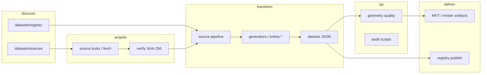

# TerritoryKit architecture reference

Concise map of the repository as of handoff creation. Prefer linked source files over this summary when implementing.

## Monorepo layout

**Workspaces:** `packages/*`, `examples/*`, `docs` (`pnpm-workspace.yaml`).  
**Orchestration:** Turbo (`turbo.json`), root scripts in `package.json`.

### Published / core packages

| Package                                | Responsibility                                           | Main entry                      | Depends on (workspace)                |
| -------------------------------------- | -------------------------------------------------------- | ------------------------------- | ------------------------------------- |
| `@territory-kit/dataset`               | Schema, validation, geometry quality, loaders            | `packages/dataset/src/index.ts` | —                                     |
| `@territory-kit/registry`              | Dataset registry types and publishing helpers            | `packages/registry/src/`        | dataset                               |
| `@territory-kit/adapter-core`          | Renderer adapter shared contract                         | `packages/adapter-core/src/`    | dataset                               |
| `@territory-kit/core`                  | Zone engine, hierarchy, adjacency, spatial queries       | `packages/core/src/index.ts`    | dataset, registry                     |
| `@territory-kit/generators`            | Country configs, source adapters, Turkey build pipelines | `packages/generators/src/`      | core, dataset                         |
| `@territory-kit/cli`                   | `territory` CLI (import, country, tr adm3/v2)            | `packages/cli/src/index.ts`     | generators, core, dataset, …          |
| `@territory-kit/runtime`               | Viewport lifecycle, adapter coordination                 | `packages/runtime/src/`         | adapter-core, core, dataset, registry |
| `@territory-kit/game`                  | Territory game engine                                    | `packages/game/src/`            | core, dataset                         |
| `@territory-kit/migration`             | Dataset diff / spatial migration                         | `packages/migration/src/`       | core, dataset                         |
| `@territory-kit/maplibre`              | MapLibre GL adapter + delivery                           | `packages/maplibre/src/`        | adapter-core, dataset, registry       |
| `@territory-kit/leaflet`               | Leaflet adapter                                          | `packages/leaflet/src/`         | adapter-core, dataset, registry       |
| `@territory-kit/openlayers`            | OpenLayers adapter                                       | `packages/openlayers/src/`      | adapter-core, dataset, registry       |
| `@territory-kit/react-native`          | Mobile runtime integration                               | `packages/react-native/src/`    | core, dataset, registry               |
| `@territory-kit/nestjs`                | NestJS server integration                                | `packages/nestjs/src/`          | core, dataset, …                      |
| `@territory-kit/data-{tr,us,de,jp,id}` | Country-specific packaged datasets / loaders             | `packages/data-*/src/`          | core                                  |

Boundary enforcement: `scripts/check-package-boundaries.mjs`.

### Non-package directories

- `datasets/registry/`, `datasets/sources/` — catalogs and provider metadata
- `datasets/generated/` — tracked generated snapshots (e.g. TR ADM3 pilot; not necessarily national rc.7)
- `reports/` — audit baselines and evidence JSON/MD
- `scripts/` — data builds, audits, release checks, registry generation
- `examples/` — web MapLibre, Leaflet, React Native, node-basic
- `adr/`, `docs/` — human documentation (VitePress site in `docs/`)

## Data and geographic pipeline

**Canonical stages:** `docs/source-pipeline.md`.

**Turkey ADM3 / v2 national (implementation):**

- Ingestion/adapters: `packages/generators/src/turkey-adm3-ingestion.ts`, `turkey-adm3-adapters.ts`
- OSM: `turkey-adm3-osm.ts`, `turkey-osm-barriers.ts`
- Generated fallback: `turkey-smart-fallback.ts`, network: `turkey-network-faces.ts`, `turkey-network-bounded.ts`, `turkey-organic-routing.ts`
- Hybrid priority: `turkey-v2-hybrid.ts`; national assembly: `turkey-v2-national.ts`
- Delivery: `render-artifacts.ts`, `turkey-v2-delivery.ts` (generators); MapLibre package for client delivery
- CLI: `packages/cli` — `tr adm3`, `tr v2 national`

**Registry vs bytes:** `datasets/registry/countries.json` lists default providers (TR ADM1+ still `geoboundaries` in registry while `datasets/sources/TR/national.json` documents HDX COD-AB for ADM0–ADM2).

## Test and verification ownership

| Concern                    | Command / location                       |
| -------------------------- | ---------------------------------------- |
| Unit/integration           | `pnpm test` (Turbo per package)          |
| Typecheck / lint           | `pnpm typecheck`, `pnpm lint`            |
| Boundaries                 | `pnpm package:boundaries`                |
| Geometry fixtures          | `pnpm geometry:validate:fixtures`        |
| TR ADM3 audit regression   | `pnpm data:tr:adm3:audit:test`           |
| Full verify (CI Node 24)   | `pnpm verify`                            |
| Release gates (CI Node 22) | `pnpm release:check`                     |
| PostGIS                    | `pnpm postgis:validate` (CI job)         |
| Visual MapLibre            | `pnpm test:visual:maplibre` (CI Node 24) |

## Release model

- Changesets in `.changeset/`; version PRs via `changeset-release/main` branch workflow.
- `pnpm release:check`, `scripts/publish-packages.mjs`, `release.yml`.
- Dataset registry publishing: `dataset-registry-publish.yml`, `pnpm registry:publish:smoke`.
