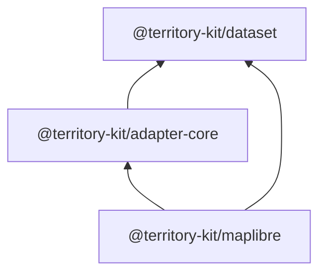

# Adapter Contract

`@territory-kit/adapter-core` defines renderer-independent contracts for map adapters.

## Dependency Boundary

Adapter-core imports only `@territory-kit/dataset` for the shared `TerritoryError` model. It does
not import renderer packages, DOM types, React Native types, filesystem APIs, or network APIs.

## Public Concepts

- `TerritoryRendererAdapter<TTarget>`
- `TerritoryAdapterCapabilities`
- `TerritoryRenderSource`
- `TerritoryRenderSourceType`
- `TerritoryRenderTheme`
- `TerritoryRenderState`
- `TerritoryRenderSelection`
- `TerritoryRenderTransition`
- `TerritoryRenderEvent`
- `TerritoryRenderEventType`
- `TerritoryRenderViewport`
- `TerritoryAdapterLifecycleState`

Capabilities are immutable boolean maps. Known keys include `geoJson`, `vectorTiles`,
`featureState`, `hover`, `click`, `selection`, `symbols`, `transitions`,
`runtimeThemeUpdates`, `sourceReplacement`, and `viewportEvents`. Extra boolean keys are allowed
for future adapters.

## Lifecycle Policy

- `attach(target)` moves an adapter toward `attached`.
- Attaching the same target twice must be deterministic and must not duplicate listeners.
- Attaching a different target replaces the previous target or detaches it first.
- `detach()` is idempotent when already detached.
- `disposed` is terminal: later failure normalization must not move lifecycle state back to
  `error`, and later attach attempts must fail with `ADAPTER_DISPOSED`.
- `setSource`, `updateState`, and `updateTheme` require `attached` unless an adapter documents a
  separate legacy method.
- Calls after disposal throw `TerritoryError` with `ADAPTER_DISPOSED`.
- Calls before attach throw `TerritoryError` with `ADAPTER_NOT_ATTACHED`.
- Unsupported renderer features throw `TerritoryError` with `CAPABILITY_UNSUPPORTED`.

Async adapters should reject with `TerritoryError`; when they wrap an underlying renderer error,
the original error should be preserved as `cause`.

## MapLibre Validation

`@territory-kit/maplibre` now implements `TerritoryRendererAdapter<TerritoryMapLibreMap>` while
keeping `updateData` and the previous callback behavior. The package exposes immutable capability
metadata through `TERRITORY_MAPLIBRE_ADAPTER_CAPABILITIES`.

For MapLibre, `sourceReplacement` means replacing the data of the configured existing GeoJSON source
with `setData`. It does not remove and re-add renderer sources or implement vector source lifecycle
replacement in Sprint 11.
