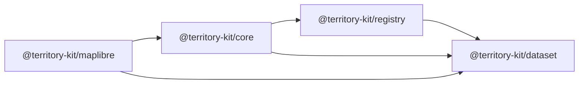
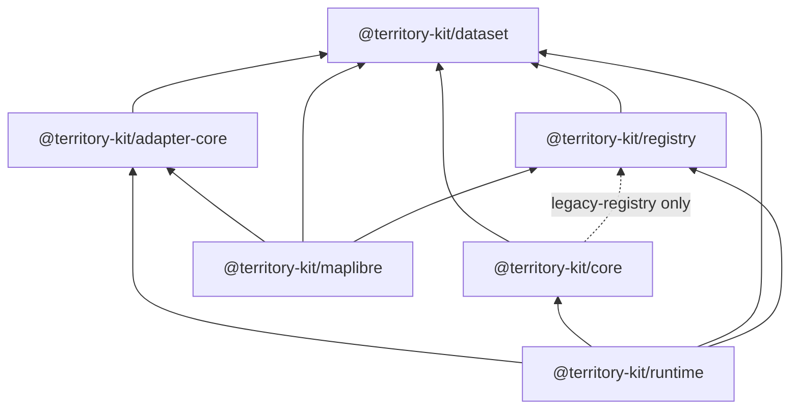

# Core And Registry Boundary

## Previous Graph

Core re-exported registry APIs from its root. MapLibre imported registry client types through
core, even though registry discovery and artifact resolution belong to `@territory-kit/registry`.

## New Graph

There is no circular workspace dependency.

## Responsibility Movement

Core remains responsible for in-memory engine behavior:

- spatial lookup
- hierarchy
- adjacency
- boundary, center, bbox, viewport, and polygon query primitives
- zoom-level strategy

Registry remains responsible for:

- registry discovery
- artifact resolution
- artifact download
- checksum verification
- cache-oriented installation

Runtime becomes the future coordination layer. It imports core and registry rather than pushing
registry behavior deeper into core.

## Compatibility Exports

The following core root exports are preserved but deprecated:

- `createTerritoryRegistryClient`
- registry client, artifact, cache, and resolver types re-exported from `@territory-kit/registry`

They are also exposed from `@territory-kit/core/legacy-registry` so compatibility imports can be
isolated before the next major removal.

## Removal Plan

1. New docs and examples should import registry APIs from `@territory-kit/registry`.
2. Compatibility users may move temporary imports to `@territory-kit/core/legacy-registry`.
3. The next major release may remove registry re-exports from `@territory-kit/core` root.
4. The `legacy-registry` subpath should remain for one major line after root removal if the package
   line needs a softer migration.

## Open Questions

- Core cannot remove the registry dependency completely while root compatibility exports remain.
- A separate `legacy-registry` subpath is useful because boundary checks can restrict direct
  registry imports to one documented file.
- Country loaders should move toward runtime or registry-facing packages when they require
  installation orchestration; pure resolver-driven dataset loading can stay as compatibility.
