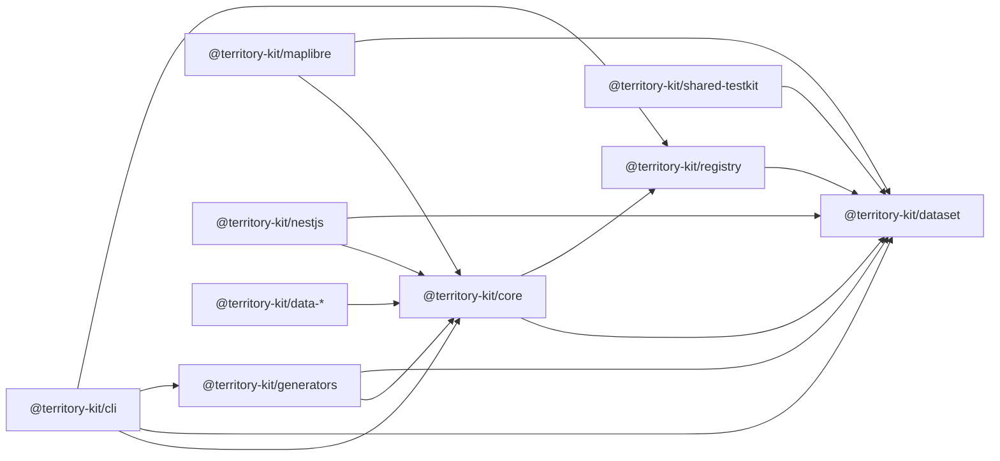

# Runtime Architecture Audit

Date: 2026-07-18  
Branch: `refactor/runtime-architecture`

## Existing Package Dependency Graph

Before Sprint 11, the workspace package graph was:

The only circular dependency risk was architectural rather than literal: `@territory-kit/core`
owned in-memory query primitives while also re-exporting registry creation and types.

## Core Responsibilities

`@territory-kit/core` currently owns:

- `createTerritoryEngine`
- in-memory spatial lookup with Flatbush
- hierarchy traversal
- adjacency query helpers
- boundary, center, bbox, viewport, and polygon query primitives
- zoom-to-admin-level strategy helpers
- resolver-driven country and query dataset loaders
- compatibility registry re-exports from the package root

Core does not import MapLibre, NestJS, DOM APIs, filesystem APIs, or network APIs.

## Registry And Core Coupling

The direct coupling was:

- `packages/core/package.json` declared `@territory-kit/registry`.
- `packages/core/src/index.ts` re-exported `createTerritoryRegistryClient` and registry types.
- `loadTerritoryCountryDataset` and `loadTerritoryQueryDataset` accepted registry-like
  interfaces, but did not directly import registry implementation code.
- MapLibre imported `TerritoryRegistryClient` through core only for type convenience.

Sprint 11 keeps core root compatibility exports, but moves them through
`@territory-kit/core/legacy-registry` and documents them as deprecated.

## MapLibre Public API

`@territory-kit/maplibre` exposed:

- `zonesToFeatureCollection`
- `createTerritoryMapLibreLayers`
- `createTerritoryMapLibreAdapter`
- `createTerritoryMapLibreSource`
- `createTerritoryMapLibreLayer`
- `createTerritoryMapLibreLevelLayers`
- feature-state helpers for hover and selection
- `createTerritoryMapLibreController`

The existing adapter contract was MapLibre-specific: `attach`, `detach`, `updateData`, and
`updateTheme`. It did not expose shared capabilities or lifecycle state.

## Error Behavior

Before Sprint 11:

- `TerritoryDatasetValidationError` preserved validation issues but had no stable error code.
- `TerritoryZoneNotFoundError` was core-specific and uncoded.
- Registry, loaders, generators, and adapter helpers mostly threw plain `Error`.
- `latLngToZone` returned `null` for invalid coordinates and no-match cases.
- Query methods returned empty arrays for valid no-result traversals.

Sprint 11 keeps no-match `null` and empty-array behavior, while adding `TerritoryError` codes for
real invalid input, lifecycle misuse, registry misses, artifact corruption, and unsupported
adapter capabilities.

## Version And Package Consistency

The public packages are on the `1.1.0` package line. The root workspace is private and its version
is workspace metadata only; Sprint 11 changes it to `0.0.0-private` to avoid implying a public
root package release.

Changesets uses a fixed package group for public packages. Sprint 11 adds
`@territory-kit/adapter-core` and `@territory-kit/runtime` to that group.

## Breaking Change Assessment

The planned changes are backward-compatible for existing public APIs:

- Core registry exports remain available from the package root and are also available through
  `@territory-kit/core/legacy-registry`.
- Core registry exports are deprecated for future removal, not removed.
- MapLibre keeps `attach`, `detach`, `updateData`, `updateTheme`, callbacks, and source helpers.
- Existing validation and lookup no-match behavior is preserved.

New APIs are additive: shared errors, adapter-core contracts, runtime lifecycle contracts, and
MapLibre capability/lifecycle conformance.
