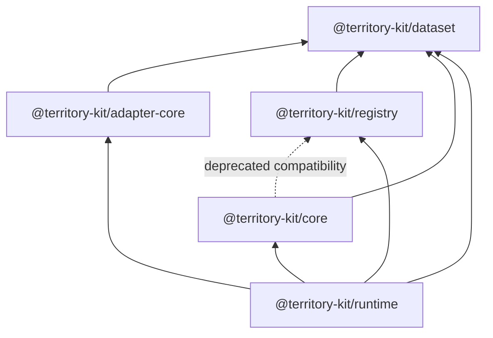

# Runtime Contract

`@territory-kit/runtime` is the future coordination boundary for datasets, registry artifacts,
core engines, cache, request cancellation, workers, viewport lifecycle, and renderer adapters.

Sprint 11 implemented the minimal lifecycle foundation. Sprint 12 turns that boundary into an
active viewport request orchestration runtime.

## Public API

- `TerritoryRuntime`
- `TerritoryRuntimeOptions`
- `TerritoryRuntimeState`
- `TerritoryRuntimeStatus`
- `TerritoryRuntimeEvent`
- `TerritoryRuntimeEventType`
- `TerritoryRuntimeEventListener`
- `TerritoryRuntimeSubscription`
- `TerritoryRuntimeDatasetResolver`
- `TerritoryRuntimeCache`
- `TerritoryRuntimeClock`
- `TerritoryRuntimeLogger`
- `TerritoryRuntimeRequestContext`
- `TerritoryRuntimeDisposeResult`
- `TerritoryRuntimeViewport`
- `TerritoryRuntimeBounds`
- `TerritoryRuntimeResultSummary`
- `TerritoryRuntimeCacheSummary`
- `TerritoryRuntimeScheduler`
- `TerritoryRuntimeScheduledTask`
- `TerritoryRuntimeRequestOptions`
- `TerritoryRuntimeRequestResult`
- `TerritoryRuntimeCancelResult`
- `TerritoryRuntimeEngineFactory`
- `createMemoryTerritoryRuntimeCache`
- `createTerritoryRuntime`

The active statuses are `idle`, `scheduled`, `resolving`, `loading`, `querying`,
`updating-adapter`, `ready`, `error`, and `disposed`. Catalogs, binary indexes, and worker
transports remain deferred to Sprint 13.

## Lifecycle Policy

- `createTerritoryRuntime()` creates an isolated runtime with no global singleton.
- `getState()` and the `state` getter return the current immutable state snapshot.
- `subscribe(listener)` registers a listener. Adding the same listener twice is deterministic and
  does not duplicate callbacks.
- `unsubscribe(listener)` removes a listener and returns whether it was present.
- Listener failures are converted to `TerritoryError` and reported through deterministic
  `listener-error` events without stopping other listeners.
- `dispose()` emits `state-change` and `disposed`, clears listeners, and returns
  `TerritoryRuntimeDisposeResult`.
- Double dispose is safe and returns `alreadyDisposed: true`.
- Invalid post-dispose operations throw `TerritoryError` with `RUNTIME_DISPOSED`.
- `setViewport()` validates bounds and zoom before creating a request. Duplicate completed
  viewports are skipped unless `force: true`.
- Every request has a request id, revision, `AbortController`, start time, viewport, selected
  level, and cache key once an engine is ready.
- New requests cancel previous work by default. `cancelPreviousRequest: false` allows overlap, but
  stale responses cannot update state or adapters.
- `requestTimeoutMs` produces `DOWNLOAD_TIMEOUT`. User/supersede/dispose aborts produce normal
  `REQUEST_ABORTED` results.
- Attached adapters are updated only after capability checks through `@territory-kit/adapter-core`.

## Dependency Boundary

Runtime does not depend on MapLibre, NestJS, Node-only filesystem helpers, or renderer-specific
types.
