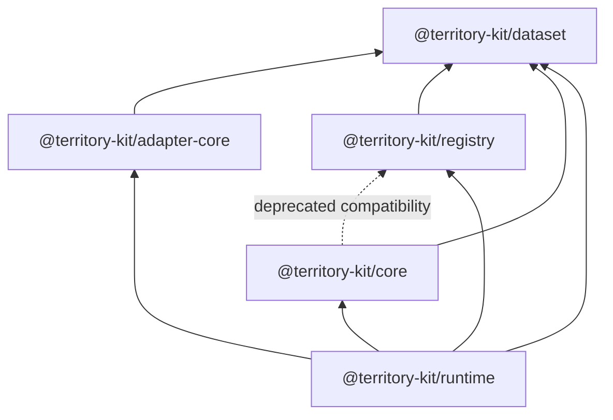

# Runtime Contract

`@territory-kit/runtime` is the future coordination boundary for datasets, registry artifacts,
core engines, cache, request cancellation, workers, viewport lifecycle, and renderer adapters.

Sprint 11 implements only the minimal lifecycle foundation.

## Public API

- `TerritoryRuntime`
- `TerritoryRuntimeOptions`
- `TerritoryRuntimeState`
- `TerritoryRuntimeStatus`
- `TerritoryRuntimeEvent`
- `TerritoryRuntimeEventType`
- `TerritoryRuntimeEventListener`
- `TerritoryRuntimeSubscription`
- `TerritoryRuntimeDatasetResolver`
- `TerritoryRuntimeCache`
- `TerritoryRuntimeClock`
- `TerritoryRuntimeLogger`
- `TerritoryRuntimeRequestContext`
- `TerritoryRuntimeDisposeResult`
- `createTerritoryRuntime`

The only active statuses are `idle` and `disposed`. Initialization, downloads, catalogs, workers,
and viewport orchestration are intentionally deferred.

## Lifecycle Policy

- `createTerritoryRuntime()` creates an isolated runtime with no global singleton.
- `getState()` and the `state` getter return the current immutable state snapshot.
- `subscribe(listener)` registers a listener. Adding the same listener twice is deterministic and
  does not duplicate callbacks.
- `unsubscribe(listener)` removes a listener and returns whether it was present.
- Listener failures are converted to `TerritoryError` and reported through deterministic
  `listener-error` events without stopping other listeners.
- `dispose()` emits `state-change` and `disposed`, clears listeners, and returns
  `TerritoryRuntimeDisposeResult`.
- Double dispose is safe and returns `alreadyDisposed: true`.
- Invalid post-dispose operations throw `TerritoryError` with `RUNTIME_DISPOSED`.

## Dependency Boundary

Runtime does not depend on MapLibre, NestJS, Node-only filesystem helpers, or renderer-specific
types.
