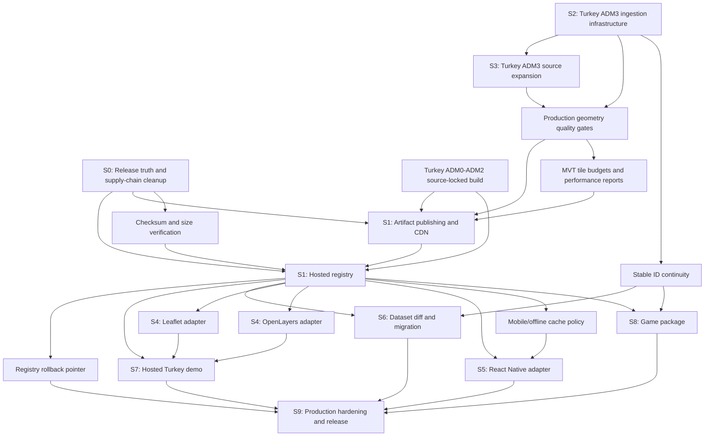

# Production Roadmap Dependency Graph

Audit date: 2026-07-28

This graph shows the practical dependency order discovered by the production gap
audit. It adds a release-truth precondition before the originally requested
hosted registry work.

## Dependency Notes

| Node                         | Depends on                                                | Reason                                                                                              |
| ---------------------------- | --------------------------------------------------------- | --------------------------------------------------------------------------------------------------- |
| Release truth                | none                                                      | Documentation and npm registry state currently disagree, so it is the safest precondition.          |
| Hosted registry              | release truth, artifact publishing, checksum verification | A registry is only production-grade if referenced artifacts are immutable and verifiable.           |
| Artifact publishing          | source locks, quality gates                               | CDN artifacts should not be uploaded without source/license and geometry checks.                    |
| Turkey ADM3 source expansion | ADM3 ingestion infrastructure                             | Source expansion before ingestion hardening would multiply manual exceptions.                       |
| Leaflet/OpenLayers           | runtime and hosted registry                               | Adapters should use the same loading path as MapLibre rather than invent per-adapter data plumbing. |
| React Native                 | offline cache policy and hosted registry                  | Mobile needs deterministic cache, update, and verification behavior.                                |
| Dataset diff/migration       | stable IDs and registry versions                          | Migrations only matter once releases are versioned and comparable.                                  |
| Hosted Turkey demo           | hosted registry and published artifacts                   | The demo should prove production loading, not local artifact paths.                                 |
| Game package                 | stable data/runtime APIs                                  | Game helpers should not force late breaking changes into geospatial packages.                       |
| Production hardening         | all production flows                                      | Rollback, monitoring, and CI budgets are meaningful only after the production pipeline exists.      |
